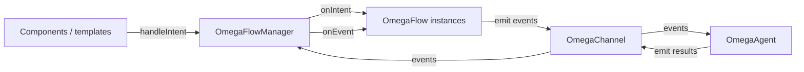

# Core concepts

This topic defines the **vocabulary** and **relationships** between the main runtime types — the same role as Angular’s *Essentials* topics that name the framework’s core building blocks.

omega-angular maps the **Omega** mental model to Angular: a shared **channel** for **`OmegaEvent`**, **`OmegaIntent`** objects for user/system requests, **flows** for feature orchestration, **agents** for reactions and IO, and a **flow manager** that ties routing of intents to whichever flows are active. For *why* this exists and when it pays off, read **[Vision & why Omega](./vision-and-why)** first.

## Glossary

| Term | Meaning |
| ---- | ------- |
| **Channel** | Broadcast bus (`OmegaChannel`) — no replay; everyone subscribed sees each emission. |
| **Intent** | Request object (`OmegaIntent`) with a **name** and optional **payload** — handled by active flows. |
| **Flow** | `OmegaFlow` subclass: implements **`onIntent`** and optionally **`onEvent`** for one feature id. |
| **Active flow** | Registered on `OmegaFlowManager`; receives intents and forwarded channel events. |
| **Agent** | Listens to **all** channel events and runs **behavior** rules → **reactions** (your code does HTTP/storage). |
| **Namespace** | Optional tag on events (`OmegaChannelNamespace`) to partition traffic on the same channel. |
| **Wire name** | Stable string for event/intent names (constants or enums + helpers). |

## How the pieces relate

- **Intents** enter through **`handleIntent`** only (not automatically from Router).
- **Events** are **broadcast**: flows **and** agents both observe; the manager also forwards events to active flows’ **`onEvent`**.

## Layering rules (recommended)

1. **Views** — trigger intents or subscribe to state; avoid embedding HTTP when ESLint rules are enabled.
2. **Flows** (`**/omega/*.flow.ts`) — validation, orchestration, channel emissions.
3. **Agents + services** — side effects: REST, storage, analytics.
4. **`omega-setup.ts`** — composition: `provideOmega`, router bridges, guards.

Across **multiple features in one Angular codebase**, the same vocabulary (**intents**, **events**, **flows**, **agents**) keeps reviews and onboarding predictable.

## What’s next

| Topic | Guide |
| ----- | ----- |
| End-to-end sequence | [Data flow](./data-flow) |
| Channel API | [Channel & events](./channel-events) |
| Intents & manager | [Intents, flows & manager](./intents-flows-manager) |
| Agents | [Agents & behaviors](./agents-behaviors) |
| Router integration | [Navigation & Router](./navigation-router) |
| Exports cheat sheet | [API reference](./api-reference) |
