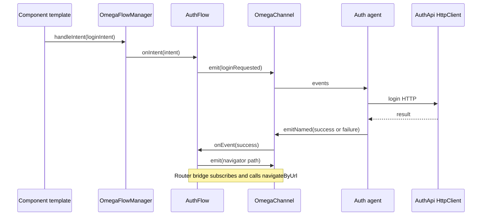

# Data flow end to end

This page describes how a user action moves through **omega-angular** in a typical app: Angular views → **intents** → **flows** → **channel events** → **agents** (IO) → events back → **flows** / **UI** / **router**.

## Mental model

| Piece | Role |
| ----- | ---- |
| **`OmegaIntent`** | “What should happen?” — issued from components or services. |
| **`OmegaFlowManager`** | Sends each intent to every **active** flow’s `onIntent`. |
| **`OmegaFlow`** | Feature orchestration: validate, emit events, no direct HTTP in the flow class (keep IO in agents). |
| **`OmegaChannel`** | Broadcast bus of **`OmegaEvent`** — all listeners see each event (unless you use **namespaces** to narrow). |
| **`OmegaAgent`** | Subscribes to the channel; **behavior engines** pick the first matching rule and emit a **reaction** handled by your code (API calls, storage). |

## Sequence (login-style example)

## Where things should live

- **Components**: bind UI to `handleIntent` / read state; avoid `HttpClient` here if your ESLint rules forbid it.
- **`*.flow.ts`**: coordination only — emit events with stable wire names (`AuthWire.*` style in the example).
- **`*.agent.ts` + behaviors**: react to events; run async IO and emit results back on the channel.
- **`omega-setup.ts`**: register all flows and agents, optional `bootstrap` (e.g. `switchTo('auth')`), and infrastructure bridges (e.g. **navigator → Router**).

See also [Channel & events](./channel-events), [Intents, flows & manager](./intents-flows-manager), and [Agents & behaviors](./agents-behaviors).
